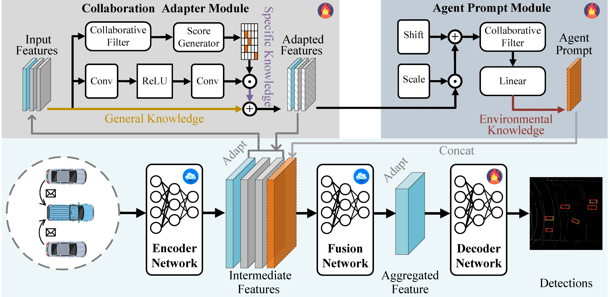

# CoPEFT (AAAI 2025)
CoPEFT: Fast Adaptation Framework for Multi-Agent Collaborative Perception with Parameter-Efficient Fine-Tuning




## Abstract
Multi-agent collaborative perception is expected to significantly improve perception performance by overcoming the limitations of single-agent perception through exchanging complementary information. However, training a robust collaborative perception model requires collecting sufficient training data that covers all possible collaboration scenarios, which is impractical due to intolerable deployment costs. Hence, the trained model is not robust against new traffic scenarios with inconsistent data distribution and fundamentally restricts its real-world applicability. Further, existing methods, such as domain adaptation, have mitigated this issue by exposing the deployment data during the training stage but incur a high training cost, which is infeasible for resource-constrained agents. In this paper, we propose a Parameter-Efficient Fine-Tuning-based lightweight framework, CoPEFT, for fast adapting a trained collaborative perception model to new deployment environments under low-cost conditions. CoPEFT develops a Collaboration Adapter and Agent Prompt to perform macro-level and micro-level adaptations separately. Specifically, the Collaboration Adapter utilizes the inherent knowledge from training data and limited deployment data to adapt the feature map to new data distribution. The Agent Prompt further enhances the Collaboration Adapter by inserting fine-grained contextual information about the environment. Extensive experiments demonstrate that our CoPEFT surpasses existing methods with less than 1\% trainable parameters, proving the effectiveness and efficiency of our proposed method.


## Installation

You can refer to the CoAlign Installation Guide [Chinese Ver.](https://udtkdfu8mk.feishu.cn/docx/LlMpdu3pNoCS94xxhjMcOWIynie) or [English Ver.](https://udtkdfu8mk.feishu.cn/docx/SZNVd0S7UoD6mVxUM6Wc8If6ncc) to learn how to install this repo. 


## Data Preparation

The data preparation is also the same as that of CoAlign and [OpenCOOD](https://opencood.readthedocs.io/en/latest/md_files/data_intro.html). For the DAIR-V2X dataset, please use the [supplemented annotations](https://siheng-chen.github.io/dataset/dair-v2x-c-complemented/).


## Quick Start

### Verify the impact of inconsistent deployment data.

Suppose you have trained a collaborative perception model on the OPV2V dataset in the standard way and saved it in directory `#your_pretrained_model_path`. You can execute the following command to achieve this purpose:
```
python opencood/tools/inference_T2D.py --model_dir #your_pretrained_model_path
```
### Train your CoEPFT.
To quickly train your own CoEPFT, first modify the configuration file of CoEPFT (in `#your_CoEPFT_yaml_path`) and the run the following commond
```
python opencood/tools/train_fine_tuning.py --fine_tuning_hypes_yaml #your_CoEPFT_yaml_path --few_shot_rate 0.1
```

This is an example of the configuration file of CoPEFT. The dataset path and the pre-trained model path must be corrected. 
```yaml
name: dairv2x_coalign_copeft_example

fine_tuning_setting:
  fine_tuning_flag: True
  fine_tuning_mode: "copeft"

  args: 
    dataset_args: # Configuration related to deployment dataset.
      dataset_name: 'dairv2x' 
      data_dir: "/dataset/DAIR-V2X/cooperative-vehicle-infrastructure"
      root_dir: "/dataset/DAIR-V2X/cooperative-vehicle-infrastructure/train.json"
      validate_dir: "/dataset/DAIR-V2X/cooperative-vehicle-infrastructure/val.json"
      test_dir: "/dataset/DAIR-V2X/cooperative-vehicle-infrastructure/val.json"
    fine_tuning_args: # Configuration related to CoPEFT.
      ft_core_method: point_pillar_baseline_multiscale_copeft
      pretrained_model_dir: '/code/CoPEFT/opencood/logs/opv2v_pretrain/coalign' # The pre-trained model path
      layers_to_finetune: ['cls_head', 'reg_head', 'dir_head', 'copeft_vehicle_prompt']
      lr_times:
        lr_times_rate: 10
        layers_to_lr_times: ['copeft_vehicle_prompt']
      lr: 0.0002
      lr_scheduler:
        core_method: multistep #step, multistep and Exponential support
        gamma: 0.1
        step_size: [10, 15]
      train_params:
        epoches: 20
        eval_freq: 2
        save_freq: 2
```


### Test the model
Suppose your trained CoPEFT is saved in `#your_CoEPFT_path`, and then run this command:

```
python opencood/tools/inference.py --model_dir #your_CoEPFT_path
```

## Checkpoints

The main checkpoints can be downloaded [here](https://drive.google.com/drive/folders/1RJkj4lLVqjZMxkvy2iiqm2zjfRqFmOGm?usp=drive_link), and then save them in the `opencood/logs` directory. Note that our checkpoints rely on `spconv=1.2.1`.

## Citation
```
@inproceedings{wei2025copeft,
  title={CoPEFT: Fast Adaptation Framework for Multi-Agent Collaborative Perception with Parameter-Efficient Fine-Tuning},
  author={Wei, Quanmin and Dai, Penglin and Li, Wei and Liu, Bingyi and Wu, Xiao},
  booktitle={Proceedings of the AAAI Conference on Artificial Intelligence},
  volume={39},
  number={22},
  pages={23351--23359},
  year={2025}
}
```

## Acknowledgements

Thank for the excellent collaborative perception codebases [OpenCOOD](https://github.com/DerrickXuNu/OpenCOOD) and [CoAlign](https://github.com/yifanlu0227/CoAlign).

